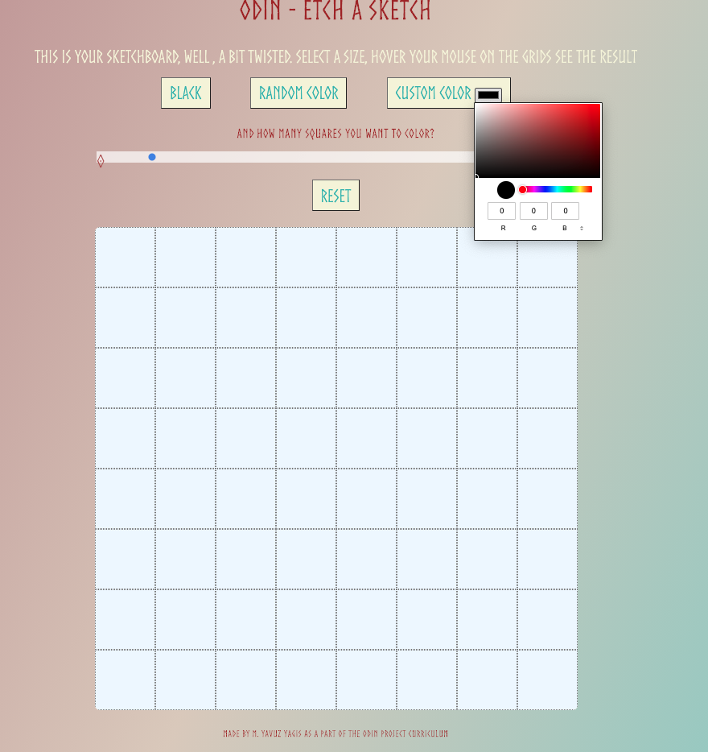
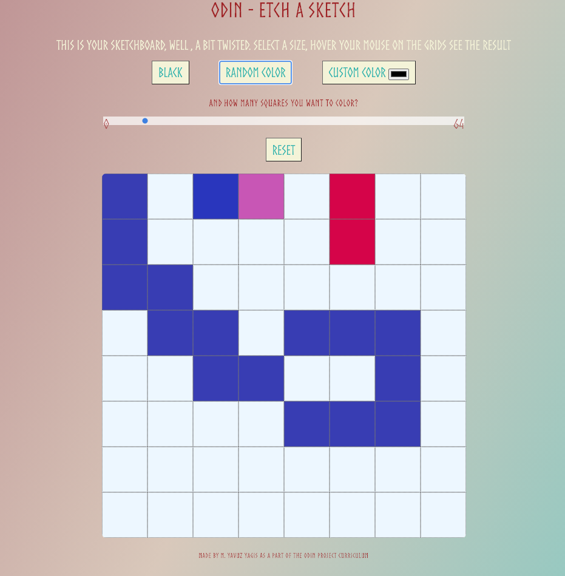

# JS Etch A Sketch
## The Odin Project Assignment

 This was one of the three Odin Assignments for Fundamentals module. 
 In this project I have made a sketchboard.
 This sketchboard is not hardcoded in terms of number of grids, but it directly takes the input from the slider value.

Also I added the random color picker and custom color palette as extras. 

I am getting used to JS!

### Some ScreenShots 

